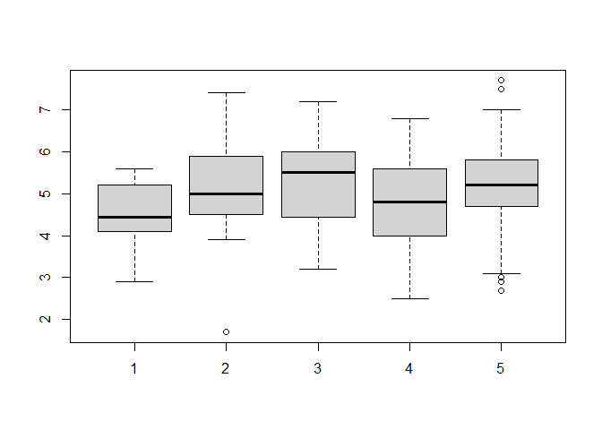
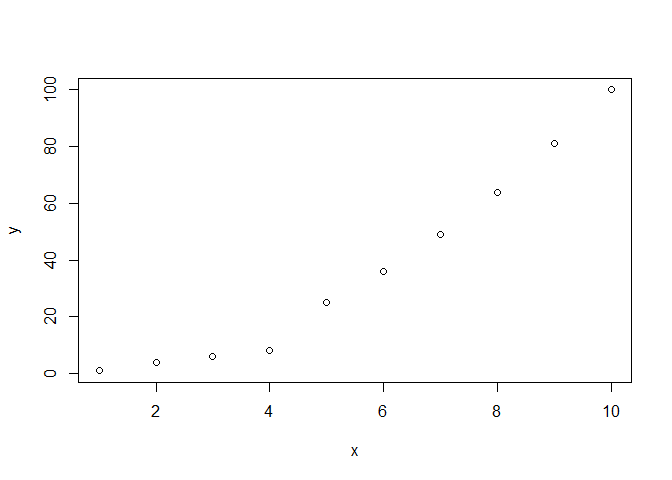
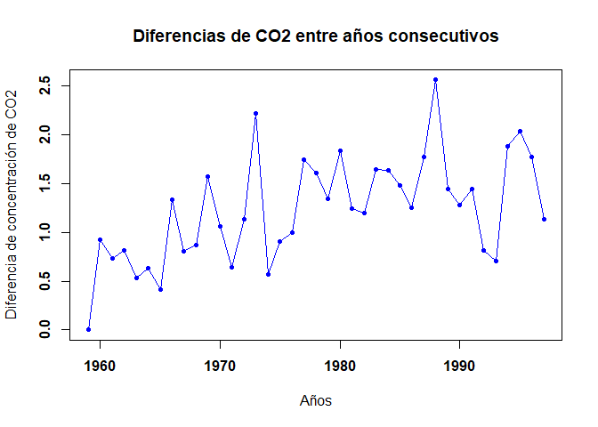
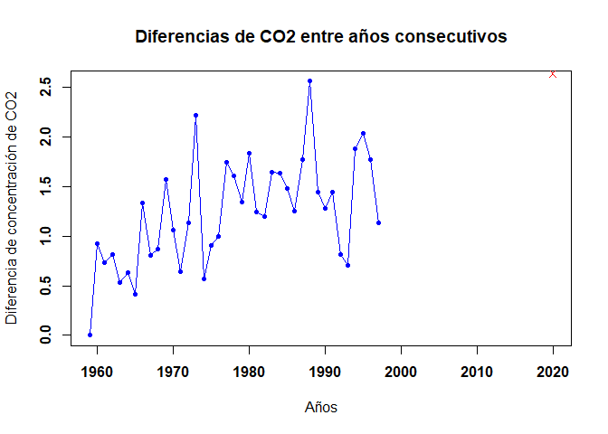

Tarea 1
================
Quiroz Cesar, Quispe Danae & Ricra Gabriel
17/11/2021

# Parte 1

# 1 Calcula los valores aproximados de:

## 1 a.

Reemplazamos los datos que nos brinda el problema teniendo en cuenta que
el “\*” es la multiplicacion y tanto como en numerador y denominador
asignarle un parentesis para que se pueda operar el problema en R.

``` r
(0.3*0.15)/(0.3*0.15+0.2*0.8+0.5*0.12)
```

    ## [1] 0.1698113

## 1 b.

Asignamos los datos teniendo en consideración que “^” representa a una
potencia y usamos la funcion *factorial* de 6 multiplicando al “e”
elevado a la -5 para ello usamos la función *expo* que nos indica el “e”
y con un paréntesis que vendría a ser la potencia.

``` r
((5^6)/(factorial(6)))*exp(-5)
```

    ## [1] 0.1462228

## 1 c.

En el numerador usamos la función *choose* que nos calcula el numero de
combinaciones de ´ k eventos en n repeticiones multiplicado al 0.4
elevado a la 7 y 0.6 elevado a la 13.

``` r
choose(20,7)*0.4^7*0.6^13
```

    ## [1] 0.1658823

# 2 Realizar la siguiente suma

## 2 a.

Como nos piden la suma de los primeros 1000 primeros números naturales
usamos la función *sum* que nos da la suma de los elementos de x. Ademas
anadimos en un parentesis “1:1000” que significa desde el elemento 1
hasta el elemento 1000.

``` r
sum(1:1000)
```

    ## [1] 500500

## 2 b.

Nos damos cuenta que es una suma notable de potencias consecutivas
(cociente notable), en consecuencia, aplicamos la formula ya conocida.

``` r
((2^11)-1)/(2-1)
```

    ## [1] 2047

# 3 El vector *grupo* representa el grupo al que pertenece una serie de alumnos

## 3 a. ¿Cuántos elementos tiene?

Se solicita la cantidad de elementos del vector *grupo* por lo que
haremos empleo del codigo *length*.

``` r
load(url("https://goo.gl/uDzU8v"))
length(grupo)
```

    ## [1] 192

## 3 b. ¿En que posiciones del vector está la letra “A”?

En este caso, para este apartado usaremos el código *which* agregando
entre paréntesis *grupo == “A”*, lo que nos indicaría en qué posiciones
del grupo se encuentra la letra A.

``` r
load(url("https://goo.gl/uDzU8v"))
which(grupo == "A")
```

    ##  [1]   2   8  17  21  28  84 101 108 111 115 123 136 190 192

# 4 El vector *nota* representa la nota de un examen de los alumnos que estan en los grupos del vector *grupo*.

## 4 a. ¿Cuanto suman todas las notas?

Usamos la funcion *sum* que nos da la suma de los elementos de x y para
el presente problema el elemento x seria nota.

``` r
load(url("https://goo.gl/uDzU8v"))
sum(nota)
```

    ## [1] 962

## 4 b. ¿Cual es la media aritmetica de todas las notas?

Sabemos que la media aritmetica es el promedio, en consecuencia, usamos
la funcion mean que nos da el promedio de los elementos de x, para el
problema x sería nota.

``` r
load(url("https://goo.gl/uDzU8v"))
mean(nota)
```

    ## [1] 5.010417

## 4 c. ¿En que posiciones estan las notas mayores de 7.0?

Como en el anterior ejercicio, empleamos la función *which* agregando
entre paréntesis *nota \> 7*, indicando las posiciones de las notas
mayores a 7.

``` r
load(url("https://goo.gl/uDzU8v"))
which(nota > 7)
```

    ## [1]  81 103 120 151

## 4 d. Visualiza las notas ordenadas de mayor a menor

Utilizaremos en este caso el codigo *sort*, que ordena elementos
ascendentemente. Sin embargo nos piden de la manera contraria por lo que
le anadimos al comienzo el código *rev*.

``` r
load(url("https://goo.gl/uDzU8v"))
rev(sort(nota))
```

    ##   [1] 7.7 7.5 7.4 7.2 7.0 6.9 6.9 6.8 6.8 6.8 6.8 6.8 6.6 6.5 6.4 6.4 6.4 6.4
    ##  [19] 6.3 6.2 6.2 6.2 6.2 6.2 6.2 6.1 6.1 6.1 6.1 6.0 6.0 6.0 6.0 6.0 6.0 5.9
    ##  [37] 5.9 5.9 5.9 5.9 5.9 5.9 5.9 5.9 5.8 5.8 5.8 5.8 5.8 5.7 5.7 5.7 5.7 5.7
    ##  [55] 5.6 5.6 5.6 5.6 5.6 5.6 5.5 5.5 5.5 5.5 5.5 5.5 5.5 5.5 5.5 5.5 5.5 5.5
    ##  [73] 5.5 5.4 5.4 5.4 5.4 5.4 5.4 5.4 5.4 5.3 5.3 5.3 5.3 5.2 5.2 5.2 5.2 5.2
    ##  [91] 5.2 5.2 5.1 5.0 5.0 5.0 5.0 5.0 5.0 5.0 5.0 5.0 4.9 4.9 4.9 4.9 4.9 4.9
    ## [109] 4.8 4.8 4.8 4.8 4.8 4.8 4.7 4.7 4.7 4.7 4.7 4.7 4.7 4.7 4.7 4.7 4.6 4.6
    ## [127] 4.6 4.6 4.5 4.5 4.5 4.5 4.5 4.5 4.4 4.4 4.4 4.4 4.4 4.4 4.4 4.3 4.3 4.3
    ## [145] 4.2 4.2 4.2 4.2 4.2 4.2 4.2 4.2 4.1 4.1 4.1 4.1 4.1 4.0 4.0 4.0 4.0 4.0
    ## [163] 4.0 3.9 3.9 3.8 3.8 3.8 3.7 3.7 3.7 3.7 3.6 3.6 3.6 3.5 3.4 3.4 3.4 3.4
    ## [181] 3.2 3.2 3.2 3.1 3.0 2.9 2.9 2.9 2.7 2.6 2.5 1.7

## 4 e. ¿En que posición esta la nota maxima?

Para identificar la posición de la nota máxima el código a emplear es
*which.max*.

``` r
load(url("https://goo.gl/uDzU8v"))
which.max(nota)
```

    ## [1] 120

# 5 A partir de los vectores *grupo* y *nota* definidos.

## 5 a. Suma las notas de los 10 primeros alumnos del vector

Usamos el código *sum* indicando entre paréntesis las 10 primeras notas
del vector *nota*.

``` r
load(url("https://goo.gl/uDzU8v"))
sum(nota[c(1:10)])
```

    ## [1] 51.8

## 5 b. ¿Cuantos alumnos hay del grupo C?

Para conocer la cantidad de alumnos en el grupo C hemos utilizado el
codigo *length* y dentro del parentesis hemos usado una funcion que solo
restrinja a los alumnos del grupo C.

``` r
load(url("https://goo.gl/uDzU8v"))
length(which(grupo == "C"))
```

    ## [1] 39

## 5 c. ¿Cuantos alumnos han aprobado?

Lo mismo que en el anterior ejercicio, diferenciando esta vez que el
vector *nota* sea mayor o igual a 5.

``` r
load(url("https://goo.gl/uDzU8v"))
length(which(nota >= 5))
```

    ## [1] 102

## 5 d. ¿Cuantos alumnos del grupo B han aprobado?

El ejercicio nos solicita la cantidad de alumnos que han aprobado, del
grupo B, por lo que volvemos a emplear *length* restringiendo a los
alumnos del grupo B y que la nota sea mayor o igual a 5.

``` r
load(url("https://goo.gl/uDzU8v"))
length(which((grupo == "B") & (nota >= 5)))
```

    ## [1] 12

## 5 e. ¿Que porcentaje de alumnos del grupo C han aprobado?

Si bien para este ejercicio se puede usar la función *quantile*, hemos
optado por usar *length* otra vez. Empleando en el numerador el mismo
código del 5.d., cambiando el grupo por C, y en el numerador la cantidad
total de alumnos del grupo C, todo esto multiplicado por 100.

``` r
load(url("https://goo.gl/uDzU8v"))
length(which((grupo == "C") & (nota >= 5)))/length(which(grupo == "C"))*100
```

    ## [1] 58.97436

## 5 f. ¿De que grupos son la maxima y minima notas de toda la muestra?

Para saber cuales son los grupos donde están la max y min nota se
utiliza el siguiente código:

Maxima nota.

``` r
load(url("https://goo.gl/uDzU8v"))
grupo[(nota == max(nota))]
```

    ## [1] "E"

Minima nota.

``` r
load(url("https://goo.gl/uDzU8v"))
grupo[(nota == min(nota))]
```

    ## [1] "B"

## 5 g. Nota media de los alumnos de grupo A y B, juntos, considerando solo a los que han aprobado.

En este ejercicio piden la nota media de los alumnos que hayan aprobado
de los grupos A y B, para eso utilizaremos la función *mean* como se
aprecia en el código:

Nota media A de los aprobados.

``` r
load(url("https://goo.gl/uDzU8v"))
mean(nota[(grupo=="A") & (nota >=5)],)
```

    ## [1] 5.425

Nota media B de los aprobados.

``` r
load(url("https://goo.gl/uDzU8v"))
mean(nota[(grupo=="B") & (nota >=5)],)
```

    ## [1] 5.958333

# 6 Calcula el percentil 66 de las notas de todos los alumnos, y también de los alumnos del grupo C.

Debido a que nos piden el percentiles de las notas de todos los alumnos
usamos la funcion *quantil(x, probs=)* donde el parametro x indica la
variable de interés para la cual se quieren calcular los cuantiles en el
problema la variable de interes es “nota”, por otro lado, el parametro
probs sirve para definir los cuantiles de interes y para el problema es
0.66.

``` r
load(url("https://goo.gl/uDzU8v"))
quantile(nota, probs = 0.66)
```

    ## 66% 
    ## 5.5

Ahora nos piden el percentil 66 de las notas de los alumnos del grupo C,
de igual manera usamos la funcion *quantil(x, probs=)* donde el
parametro x seria nota, pero abriendo corchetes el grupo que nos piden,
es decir, el grupo “c”, luego para el parametro probs es 0.66.

``` r
load(url("https://goo.gl/uDzU8v"))
quantile(nota[grupo=="C"], probs = 0.66)
```

    ##   66% 
    ## 5.808

# 7 Un alumno tiene una nota de 4.9. ¿Que porcentaje, del total de alumnos, tiene una nota menor o igual que la suya? ¿Y que porcentaje tiene una nota mayor o igual que la suya?

En primer lugar hallamos el porcentaje mejor o igual a 4.9 para ello
usamos la funcion *length* que nos da la longitud de elementos seguido
de un parentesis usamos la funcion *which*, posteriormente asignamos que
la nota debe ser menor o igual a 4.9 despues de ello lo dividimos entre
la cantidad total de alumnos (192 alumnos) y lo multiplicamos por 100
para obtener el porcentaje que nos pide el problema.

``` r
load(url("https://goo.gl/uDzU8v"))
((length(which(nota<=4.9)))/192)*100
```

    ## [1] 46.875

Ahora hallamos el porcentaje mayor o igual a 4.9 y de manera similar al
problema anterior, es decir, usamos la funcion *length* que nos da la
longitud de elementos seguido de un parentesis usamos la funcion
*which*, posteriormente asignamos que la nota debe ser mayor o igual a
4.9 despues de ello lo dividimos entre la cantidad total de alumnos (192
alumnos) y lo multiplicamos por 100 para obtener el porcentaje que nos
solicita el problema.

``` r
load(url("https://goo.gl/uDzU8v"))
((length(which(nota>=4.9)))/192)*100
```

    ## [1] 56.25

# 8 Realiza el grafico de diagramas de caja de las notas de cada grupo, para poder comparar el nivel de cada uno de ellos.

En el presente ejercicio solicitan un diagrama de caja de las notas de
cada grupo, por lo que usaremos la funcion *boxplot()* como está en el
codigo:

``` r
load(url("https://goo.gl/uDzU8v"))
boxplot(nota[grupo=="A"], nota[grupo=="B"], nota[grupo=="C"], nota[grupo=="D"], nota[grupo=="E"])
```

<!-- -->

# 9 Si la variable *conc* recoge la concentracion de plomo (en ppm) en el aire de cierta zona durante un día completo.

## 9 a. ¿Cual ha sido la concentracion maxima?

El problema nos pide la concentración máxima por ello usaremos la
función max(x) donde dicha función nos da el valor maximo en el objeto
x. Aplicandolo en el problema el objeto x es la concentracion.

``` r
load(url("https://goo.gl/uDzU8v"))
max(conc)
```

    ## [1] 47.34

## 9 b. ¿En cuantos de los muestreos se ha superado la concentracion de 40.0 ppm?

La cantidad de los muestreos superiores a 40 ppm se puede verificar con
*length()*, similar al caso de la 5.c.

``` r
load(url("https://goo.gl/uDzU8v"))
length(which(conc>40))
```

    ## [1] 61

## 9 c. ¿Cual ha sido la concentracion media del dia?

El problema nos solicita la concentracion que se dio al medio dia, en
consecuencia, aplicamos la funcion *mean* que nos da el promedio de los
elementos (concentracion).

``` r
load(url("https://goo.gl/uDzU8v"))
mean(conc)
```

    ## [1] 24.07229

## 9 d. ¿Cuales fueron las 10 mediciones mas bajas del dia?

Las mediciones con poca concentracion que se dan en un dia suelen ser
las primeras, en el ejercicio nos piden las 10 más bajas, por lo que se
usa *head(sort())* en el vector.

``` r
load(url("https://goo.gl/uDzU8v"))
head(sort(conc),10)
```

    ##  [1] 0.93 1.07 1.77 2.03 2.58 2.73 2.75 2.88 2.88 2.91

## 9 e. Si la primera medida fue a las 00:00. ¿A que hora del dia se alcanzo la concentracion maxima?

Debido a que nos piden hallar la hora donde se alcanzo la concentracion
maxima teniendo en cuenta un intervalo de 5 minutos. Para ello usamos la
funcion *which.max(x)* para obtener el indice del elemento maximo de x y
para este caso el x es la concentracion, pero le restamos uno ya que al
inicio la concentracion es 0 y luego le multiplicamos por el intervalo
de 5 minutos para conseguir la cantidad de minutos, pero como nos piden
las horas empezando desde las 00:00 horas pasamos los minutos a horas,
es decir, lo dividimos entre 60 para obtener el numero de horas.

``` r
load(url("https://goo.gl/uDzU8v"))
(c(which.max(conc))-1)*5
```

    ## [1] 705

# Parte 2

# 1 Graficar los puntos (1,1), (2,4), (3,6), (4,8), (5,25), (6,36), (7,49), (8,61), (9,81), (10,100) en un plano utilizando RStudio.

Para la creacion de un diagrama de punto se observa que los puntos dados
son coordenadas, por lo que realizamos los vectores x e y, para luego
utilizar la funcion *plot(,)*.

``` r
x <- 1:10
y <- c(1,4,6,8,25,36,49,64,81,100)
plot(x,y)
```

<!-- -->

# 2 Ingresar la matriz A en RStudio

El problema solicita crear una matriz en Rstudio, entonces para crear
dicha matriz usamos la función *matrix* y asignamos un vector con los
numeros que nos dan en dicha matriz,pero especificando el numero de
filas y columnas.

``` r
A <- matrix(c(1,2,3,4,2,4,6,8,3,6,9,12), nrow = 4 , ncol = 3)
A
```

    ##      [,1] [,2] [,3]
    ## [1,]    1    2    3
    ## [2,]    2    4    6
    ## [3,]    3    6    9
    ## [4,]    4    8   12

# 3 Ingresar la matriz identidad de tamaño 3

El ejercicio pide crear una matriz unitaria, por lo que utilizamos
*diag()* y en el argumento se coloca la cantidad de elementos de la
diagonal principal siendo en este caso 3.

``` r
I <- diag(3)
I
```

    ##      [,1] [,2] [,3]
    ## [1,]    1    0    0
    ## [2,]    0    1    0
    ## [3,]    0    0    1

# 4 Crea una función que cree una matriz nula ingresando las dimensiones

Para la creacion de una funcion empleamos *function()*, indicando los
cambios como se aprecia en el codigo:

``` r
Z<- function(n){ I<-diag(n); for(i in 1:n){I[i,i]=0}; return(I)}
Z(4)
```

    ##      [,1] [,2] [,3] [,4]
    ## [1,]    0    0    0    0
    ## [2,]    0    0    0    0
    ## [3,]    0    0    0    0
    ## [4,]    0    0    0    0

``` r
Z(5)
```

    ##      [,1] [,2] [,3] [,4] [,5]
    ## [1,]    0    0    0    0    0
    ## [2,]    0    0    0    0    0
    ## [3,]    0    0    0    0    0
    ## [4,]    0    0    0    0    0
    ## [5,]    0    0    0    0    0

# 5 Modificar la matriz *diag(4)*, para que se parezca a la matriz B

En este ejercicio solicita el cambio de la matriz unitaria de diagonal 4
con los datos (0,2,3,4) por lo que primero se le coloca un nombre a la
matriz para luego realizar el cambio de la siguiente manera:

``` r
B <- diag(4)
B[1,1]=0
B[2,2]=2
B[3,3]=3
B[4,4]=4
B
```

    ##      [,1] [,2] [,3] [,4]
    ## [1,]    0    0    0    0
    ## [2,]    0    2    0    0
    ## [3,]    0    0    3    0
    ## [4,]    0    0    0    4

# 6 Obtener la matriz transpuesta de A (ejercicio 2)

El problema nos pide hallar la transpuesta del ejercicio 2, es decir,
las columnas de A pasarán a ser filas y sus filas pasarán a ser
columnas. Entonces empleamos la funcion t y entre parentesis la matriz
A.

``` r
A <- matrix(c(1,2,3,4,2,4,6,8,3,6,9,12), nrow = 4 , ncol = 3)
t(A)
```

    ##      [,1] [,2] [,3] [,4]
    ## [1,]    1    2    3    4
    ## [2,]    2    4    6    8
    ## [3,]    3    6    9   12

# 7 Realizar las siguientes operaciones *A+B*, *A−B*, *3B* y *AB*

Nos piden hallar una serie de operaciones con las matrices A y B
entonces las matriz A lo realizamos con la funcion *matrix*
especificando su numero de columnas y filas( problema 2) y para B lo
realizamos como en el problema 5 y luego realizamos las operaciones que
nos pide el problema.

``` r
A <- matrix(c(1,2,3,4,2,4,6,8,3,6,9,12,0,0,0,0), nrow = 4 , ncol = 4)
B <- diag(4)
B[1,1]=0
B[2,2]=2
B[3,3]=3
B[4,4]=4
(A+B)
```

    ##      [,1] [,2] [,3] [,4]
    ## [1,]    1    2    3    0
    ## [2,]    2    6    6    0
    ## [3,]    3    6   12    0
    ## [4,]    4    8   12    4

``` r
(A-B)
```

    ##      [,1] [,2] [,3] [,4]
    ## [1,]    1    2    3    0
    ## [2,]    2    2    6    0
    ## [3,]    3    6    6    0
    ## [4,]    4    8   12   -4

``` r
(3*B)
```

    ##      [,1] [,2] [,3] [,4]
    ## [1,]    0    0    0    0
    ## [2,]    0    6    0    0
    ## [3,]    0    0    9    0
    ## [4,]    0    0    0   12

``` r
(A%*%B)
```

    ##      [,1] [,2] [,3] [,4]
    ## [1,]    0    4    9    0
    ## [2,]    0    8   18    0
    ## [3,]    0   12   27    0
    ## [4,]    0   16   36    0

# 8 Crea una funcion para calcular *P^(6)*

Para la creacion de una funcion empleamos *function()*, indicando los
cambios como se aprecia en el codigo:

``` r
PM <- function(M,n){S=M; for(i in 2:n){S=S%*%M}; print(S)}
P <- matrix(c(1,-2,1,2,4,0,3,-2,1), ncol=3, nrow=3)
PM(P,6)
```

    ##       [,1]  [,2]  [,3]
    ## [1,] -1792    24 -2824
    ## [2,]  -464 -2416 -1344
    ## [3,]  -648   440  -912

# 9 Resolver el sistema de ecuaciones

Para el presente sistema de ecuaciones se crea una matriz con los
coeficientes del primer miembro y tambien un vector con los elementos
del segundo miembro. Para resolver utilizaremos la funcion *solve()*.

``` r
A <- matrix(c(3,9,3,-1,-2,1,1,1,-2), ncol=3,nrow=3)
x <- c(-1,-9,-9)
solve(A,x)
```

    ## [1] -1  2  4

# 10 Utilizando la ayuda de R, investigue para que sirven las funciones *eigen()* y *det()*

Para el presente problema nos piden investigar para que sirven tales
funciones y para ello iremos al apartado de help luego en el buscador
ponemos las funciones que nos piden.

help(eigen) eigen(): Calcula autovalores y autovectores de matrices
numericas (dobles, enteras, logicas) o complejas

help(det) det(): det calcula el determinante de una matriz. El
determinante es una funcion generica que devuelve por #separado el
modulo del determinante, opcionalmente en la escala logaritmica, y el
signo del determinante.

# 11

``` r
B <- matrix(c(c(1:10), seq(2,20,2), seq(3,30,3), seq(4,40,4), seq(5,50,5)), ncol=5, nrow = 10)
a <- matrix(c(0,1,0,0,1,1,0,1,1,0,0,1,0,0,1,1,0,1,0,1,0,1,0,1,0), ncol=5)
oo <- matrix(c(rep(0,50)), ncol=5)
E <- matrix(cbind((B%*%a),oo), nrow=10)
o <- matrix(c(rep(0,25)), nrow = 5)
A <- matrix(rbind(a,o), ncol=5, nrow = 10)
(E-(A%*%t(B)))
```

    ##       [,1] [,2] [,3] [,4] [,5] [,6] [,7] [,8] [,9] [,10]
    ##  [1,]    1   -4  -11  -15  -24  -36  -42  -48  -54   -60
    ##  [2,]    5   -2  -13  -18  -33  -54  -63  -72  -81   -90
    ##  [3,]   15   12    3    3  -12  -36  -42  -48  -54   -60
    ##  [4,]   21   18    7    8  -11  -42  -49  -56  -63   -70
    ##  [5,]   27   24   11   13  -10  -48  -56  -64  -72   -80
    ##  [6,]   42   48   42   54   36    0    0    0    0     0
    ##  [7,]   49   56   49   63   42    0    0    0    0     0
    ##  [8,]   56   64   56   72   48    0    0    0    0     0
    ##  [9,]   63   72   63   81   54    0    0    0    0     0
    ## [10,]   70   80   70   90   60    0    0    0    0     0

# 12

``` r
x <- matrix(c(1,1,1,1,1,1,-1,0,1,2), ncol = 2)
y <- matrix(c(0,0,1,1,3),ncol = 1)
h <- matrix(c(0,0,0,0,0), nrow = 5)
M <- matrix(rbind(y,h), ncol = 2)
(((t(x)%*%x)^-1)%*%t(x)%*%M)
```

    ##          [,1] [,2]
    ## [1,] 3.333333    0
    ## [2,] 2.666667    0

# 13 Diferencia entre años consecutivos de CO2

``` r
load(url("https://goo.gl/uDzU8v"))
data(co2)
means = aggregate(co2, FUN=mean)
year = as.vector(time(means))
co2 = as.vector(means)
diff(co2)
```

    ##  [1] 0.9216667 0.7375000 0.8125000 0.5350000 0.6300000 0.4100000 1.3375000
    ##  [8] 0.8100000 0.8700000 1.5691667 1.0583333 0.6375000 1.1383333 2.2183333
    ## [15] 0.5675000 0.9066667 1.0000000 1.7441667 1.6058333 1.3450000 1.8341667
    ## [22] 1.2458333 1.1983333 1.6491667 1.6383333 1.4791667 1.2491667 1.7758333
    ## [29] 2.5625000 1.4408333 1.2825000 1.4416667 0.8133333 0.7041667 1.8841667
    ## [36] 2.0341667 1.7725000 1.1308333

Plot con lineas y puntos mostrando las diferencias consecutivas de CO2
en función del tiempo (1960, 1961, etc…), en negrita

``` r
load(url("https://goo.gl/uDzU8v"))
data(co2)
means = aggregate(co2, FUN=mean)
year = as.vector(time(means))
co2 = as.vector(means)
y <- c(0, diff(co2))
plot(year,y, type = "o", pch = 20, xlab = "Años", ylab = "Diferencia de concentración de CO2", 
     main = "Diferencias de CO2 entre años consecutivos", col = "blue", font = 2)
```

<!-- -->

La diferencia de concentración de CO2 entre 2020 y 2019 fue igual a
2.64. Agregar un punto rojo representando esa diferencia al plot ya
creado (usar una forma diferente, como pch=4)

``` r
load(url("https://goo.gl/uDzU8v"))
data(co2)
means = aggregate(co2, FUN=mean)
year = as.vector(time(means))
co2 = as.vector(means)
y <- c(0, diff(co2))
plot(year, y, xlim=c(1959, 2020), type = "o", pch = 20, xlab = "Años", ylab = "Diferencia de concentración de CO2", 
     main = "Diferencias de CO2 entre años consecutivos", col = "blue", font = 2)
points(2020, 2.64, pch = 4, col = "red")
```

<!-- -->

# 14

# 14 a. Lee el archivo *rainfall.csv* como un *data.frame*

``` r
rainfalldf <- read.csv("C:/Users/Usuario/Downloads/rainfall.csv")
rainfalldf
```

    ##         num altitude sep oct nov dec jan feb mar apr  may                 name
    ## 1    110050       30 1.2  33  90 117 135 102  61  20  6.7    Kfar Rosh Hanikra
    ## 2    110351       35 2.3  34  86 121 144 106  62  23  4.5                 Saar
    ## 3    110502       20 2.7  29  89 131 158 109  62  24  3.8                Evron
    ## 4    111001       10 2.9  32  91 137 152 113  61  21  4.8          Kfar Masrik
    ## 5    111650       25 1.0  27  78 128 136 108  59  21  4.7        Kfar Hamakabi
    ## 6    120202        5 1.5  27  80 127 136  95  49  19  2.7           Haifa Port
    ## 7    120630      450 1.9  36  93 161 166 128  71  21  4.9     Haifa University
    ## 8    120750       30 1.6  31  91 163 170 146  76  22  4.9                Yagur
    ## 9    120870      210 1.1  32  93 147 147 109  61  16  4.3           Nir Etzyon
    ## 10   121051       20 1.8  32  85 147 142 102  56  13  4.5            En Carmel
    ## 11   121350      250 0.5  31  92 166 172 143  77  24  4.3       Ramat Hashofet
    ## 12   121450      170 0.8  33  86 153 159 125  72  22  4.0        Ramot Menashe
    ## 13   121550      255 1.0  28  85 152 159 133  77  24  5.8          En Hashofet
    ## 14   121630        5 0.9  34  81 145 137 100  56  12  3.1           Maayan Zvi
    ## 15   121801      100 1.2  30  86 148 149 121  68  17  4.0               Amikam
    ## 16   121900      110 1.9  29  82 140 149 126  64  18  4.5              Regavim
    ## 17   122097       70 1.5  29  81 130 142 113  61  14  3.1         Kfar Glikson
    ## 18   130020       20 1.6  33  83 132 133 111  57  14  3.7            Binyamina
    ## 19   130502       60 1.3  30  81 138 158 125  64  16  2.8           Kfar Pines
    ## 20   131001       30 0.9  32  82 128 144 106  56  14  3.6           Gan Shmuel
    ## 21   131050       80 1.1  28  78 132 148 122  64  17  3.1               Metzer
    ## 22   131599       20 1.4  34  84 126 144 109  59  14  4.2          En Hahoresh
    ## 23   131800       20 1.6  40  85 120 145 105  58  16  3.3             Maabarot
    ## 24   132302       35 2.3  38  86 124 139 100  52  13  2.9              Netanya
    ## 25   132551       60 1.6  28  88 144 166 133  74  14  3.6             Yad Hana
    ## 26   133399       25 1.5  33  80 127 141 102  58  13  3.1          Tel Yitzhak
    ## 27   133500       80 1.3  34  80 135 156 120  66  13  3.4             Kfar Hes
    ## 28   133649       20 0.8  35  80 115 133  92  56  13  3.2                Gaash
    ## 29   133850      110 1.3  29  82 136 154 128  72  15  4.1                 Eyal
    ## 30   134001       65 1.0  28  81 130 151 117  63  15  3.2           Nir Elyahu
    ## 31   134100       30 0.4  34  74 117 131  95  57  15  2.2       Kfar Shmaryahu
    ## 32   134731       10 0.6  30  80 130 146 118  61  20  3.9                Ednim
    ## 33   134850       40 0.7  34  81 127 147 111  62  16  3.6         Kiryat Shaul
    ## 34   135452       50 0.9  25  79 132 149 110  61  17  3.6          Petah Tikva
    ## 35   136580       55 0.2  22  76 125 150 114  61  18  2.6       Beerot Yitzhak
    ## 36   136650       20 0.5  29  74 114 139  93  50  12  1.7         Mikve Israel
    ## 37   136739       31 0.8  24  74 117 140  97  56  13  2.2            Bet Dagan
    ## 38   137150       50 0.6  24  84 127 145 115  63  15  2.1               Zrifin
    ## 39   137350       20 0.3  27  71 107 122  85  43  13  1.6             Palmahim
    ## 40   137430       70 0.8  23  78 119 132 112  61  14  1.9                Ramla
    ## 41   137549       75 1.1  24  84 125 145 115  60  17  2.1        Netzer Sireni
    ## 42   138250       70 1.0  23  82 116 129 105  55  15  1.2           Gan Shlomo
    ## 43   138280       60 0.8  24  82 122 138 115  59  16  1.7            Kfar Bilu
    ## 44   138947       80 0.4  26  74 114 131 111  62  14  2.2          Hefetz Haim
    ## 45   140050       20 1.6  26  83 108 135  95  50  14  1.4            Nir Galim
    ## 46   140198       50 1.3  25  83 113 133 102  53  14  1.8         Kvuzat Yavne
    ## 47   140801       60 0.8  25  81 114 136 113  57  14  2.1           Beer Tuvya
    ## 48   140852      115 0.1  21  65 103 127 108  60  14  2.6         Kfar Menahem
    ## 49   140900       30 0.4  29  76 106 125 100  47  11  2.2             Nitzanim
    ## 50   141150       50 0.7  28  76 111 127 110  53  13  2.3       Masuot Yitzhak
    ## 51   141746       90 2.3  26  66 103 119 105  55  11  3.2                Negba
    ## 52   141853       75 1.3  23  64 100 121 106  55  13  2.5            Nir Banim
    ## 53   142600       30 0.9  27  64  95 115  85  42   8  1.7                Zikim
    ## 54   143200       75 0.9  22  55  93 117  97  47   9  2.7           Brur Hayil
    ## 55   143702      100 0.7  21  55  85 112  89  42   8  2.0             Miflasim
    ## 56   143750      130 0.4  18  54  84 110  89  44   9  2.4                Gevim
    ## 57   143952       80 1.5  21  59  87 113  85  41   8  1.3             Nahal Oz
    ## 58   144001      100 1.3  19  57  82 110  81  41   9  1.6                 Saad
    ## 59   144249       65 0.4  20  55  77  91  69  38   9  0.9                Beeri
    ## 60   144702       95 0.2  14  42  67  79  62  37   9  0.5                Nirim
    ## 61   144750      100 0.0  11  31  60  66  53  31   8  0.7               Nir Oz
    ## 62   144800      135 0.1  10  29  56  65  52  31   9  0.8                Magen
    ## 63   144873      106 0.1   9  25  46  55  45  25  10  1.0           Basor Farm
    ## 64   144902       95 0.0   9  23  39  49  37  22   7  0.7          Nir Yitzhak
    ## 65   210151      340 3.1  24  97 153 177 169 101  34  7.0          Kfar Giladi
    ## 66  2496029      940 1.9  22  86 159 201 196 115  40  9.1           Golan Farm
    ## 67   210398      445 1.1  21  68 105 127 109  67  23  4.1               Yiftah
    ## 68   210452      690 2.3  20  70 115 136 126  80  26  5.5               Malkia
    ## 69   210650      690 3.3  27  87 137 168 158  95  32  6.2                Yaron
    ## 70   210700      110 3.1  34 100 138 173 126  75  28  7.9              Metsuba
    ## 71   210748      300 3.7  36 112 160 201 153  92  34  9.5                Eilon
    ## 72   210902      600 2.6  35 106 162 205 179 106  35  7.8              Fasutta
    ## 73   211350      380 2.3  36 115 169 204 160  95  32  9.1               Yehiam
    ## 74   211415      480 3.2  30 112 170 209 183 105  35  8.3           Kfar Mahol
    ## 75   211600      680 2.3  28 100 171 220 192 109  34  7.6                Meron
    ## 76   211900      930 2.3  24  87 136 168 136  83  27  6.7            Har Knaan
    ## 77   212168      825 3.4  37 122 202 238 190 114  38 12.2             Horashim
    ## 78   212351      600 1.8  27  89 145 175 150  89  29  6.6               Amirim
    ## 79  2493300      585 2.9  22  79 116 151 138  86  29  7.1            Yehonatan
    ## 80   212601      425 1.8  27  91 150 177 148  90  30  6.7                Farod
    ## 81   212651      225 2.0  20  71 118 144 124  71  24  5.2                Amiad
    ## 82   212901       20 1.8  34  93 138 162 123  70  21  4.8                Yavor
    ## 83   212950        0 0.9  19  59 103 125 105  64  20  5.1                Hukuk
    ## 84   213052      270 1.4  22  75 124 142 123  71  25  6.9             Dir Hana
    ## 85  2494553      375 1.0  16  57 103 123 123  79  25  4.9          Avney Eitan
    ## 86   213451       40 0.3  18  55  98 110  96  57  16  5.1           Kfar Hitim
    ## 87   213598      310 0.6  20  62 112 126 109  59  19  4.7                 Lavi
    ## 88   213901      200 1.3  22  77 123 134 119  62  21  6.1            Hasolelim
    ## 89   214101      195 0.5  19  59 110 122 108  56  19  6.2             Sde Ilan
    ## 90   214202      -50 0.6  15  50  90 101  91  50  17  4.9              Hazorim
    ## 91   214251      180 1.1  27  84 137 150 127  69  22  7.2   Bet Lehem Haglilit
    ## 92   214700      170 0.6  18  64 123 135 126  65  19  5.3           Bet Keshet
    ## 93   214950      -20 1.1  14  50  91 104  96  53  15  5.7              Bet Gan
    ## 94   215701      150 0.4  19  68 131 140 126  72  21  5.5               Ahsael
    ## 95   216101      125 0.4  16  57  97 110 101  57  17  5.0                Gazit
    ## 96   216250      150 0.3  18  51  88 100  93  57  17  4.9      Ahuzat Shoshana
    ## 97   220049      125 1.4  26  74 132 138 113  63  19  5.4            Neve Yaar
    ## 98   220300       50 0.8  26  75 140 141 123  67  20  4.7        Kfar Yehoshua
    ## 99   220350       80 0.7  23  68 122 122 108  62  17  4.9          Ramat David
    ## 100  220550      100 1.0  18  63 115 113 101  58  16  4.4              Geniger
    ## 101  220601      110 1.0  20  65 116 114 102  59  16  4.5                Sarid
    ## 102  220850      100 1.2  17  62 118 120 104  62  18  5.5                Mizra
    ## 103  220901       75 1.1  28  84 150 156 131  71  22  4.7              Hazorea
    ## 104  220950       40 0.9  19  64 118 116 101  58  17  4.1    Kfar Baruh Sekher
    ## 105  221202       75 1.4  26  78 141 153 128  73  20  6.0       Mishmar Haemek
    ## 106  221450       60 0.7  20  61 101 110  97  55  16  4.5     Merhavia Kibbutz
    ## 107  221650       50 0.2  17  50  86  98  91  51  16  3.2              Moledet
    ## 108  221751      110 0.9  20  68 123 137 131  64  20  4.4             Givat Oz
    ## 109  221801      100 0.3  18  55  88 102  91  49  14  3.8               Izrael
    ## 110  230051       25 0.2  17  57  91 104  92  50  15  3.2        Kfar Yehezkel
    ## 111  230300       20 0.2  15  52  85 100  90  49  15  2.9      En Harod Meuhad
    ## 112  230453        0 0.1  17  47  79  94  85  48  15  2.9          Bet Hashita
    ## 113  230601     -165 0.2  14  39  62  73  67  41  12  4.0              Hemdiya
    ## 114  230750     -100 0.2  15  43  77  92  89  50  13  4.0            Nir David
    ## 115  230950     -110 0.1  15  39  65  77  73  40  11  4.2              Shluhot
    ## 116  240082      430 0.3  17  48  79  92  89  51  17  5.2         Maale Gilboa
    ## 117  241381      275 0.2  23  73 129 147 128  71  19  2.7               Elkana
    ## 118  242550      180 0.9  19  73 107 130 120  68  17  4.6             Shaalbim
    ## 119  243101      200 0.7  18  70 108 134 116  67  16  4.5              Nahshon
    ## 120  243150      125 0.9  21  75 112 131 115  65  14  2.5                Hulda
    ## 121  243200       70 0.6  24  77 111 134 113  64  14  1.8              Yesodot
    ## 122  243500      700 1.0  21  81 137 165 161  92  22  6.3        Kiryat Anavim
    ## 123  243799      530 1.3  21  79 123 149 140  81  18  5.5             Bet Meir
    ## 124  244352      722 1.4  20  79 132 165 163  91  21  5.1                Tsoba
    ## 125  244730      815 0.6  14  55 104 132 131  75  19  6.5     Jerusalem Merkaz
    ## 126  244850      740 0.5  13  52 103 134 136  74  17  5.4 Jerusalem Saint Anne
    ## 127  245500      200 0.3  20  64 103 128 117  63  15  3.7                 Zora
    ## 128  246550      360 0.3  19  59  99 128 116  67  17  3.9            Bet Jamal
    ## 129  247211      955 1.4  18  58 113 139 131  76  19  6.6          Rosh Tzurim
    ## 130  247412      930 0.7  16  56 109 139 129  80  19  5.8            Migdal Oz
    ## 131  247550      270 0.4  16  45  79 106  92  49  13  3.4           Bet Govrin
    ## 132  248360      780 0.0   6  23  48  65  56  33   7  1.0               Carmel
    ## 133  248397      450 0.4  10  34  58  76  62  43  11  2.6                Lahav
    ## 134  250151      110 0.4  16  48  75 102  83  42   9  1.6                Dorot
    ## 135  250250      180 0.1  14  45  70  96  80  43   9  2.1               Ruhama
    ## 136  250398      250 0.2  12  35  59  81  66  39   8  1.3             Bet Kama
    ## 137  250600      100 0.1  12  36  55  76  59  38   8  1.6               Shoval
    ## 138  251131      650 0.1  10  25  53  70  59  41  11  1.1                Yatir
    ## 139  251569      600 0.1   7  13  23  31  28  20   6  1.4                 Arad
    ## 140  251599      330 0.5  10  21  41  55  44  30   8  2.5                 Omer
    ## 141  251690      280 0.5   9  18  38  48  40  29   9  3.6           Beer Sheva
    ## 142  252506      290 0.1   4  10  19  31  18  16   4  0.8              Revivim
    ## 143  252730      310 0.1   4   7  18  26  18  14   3  0.8            Sde Hayil
    ## 144  253000      470 0.1   4   7  16  27  16  16   6  1.1            Sde Boker
    ## 145  255630      835 0.1   4   6  12  19  13  11   3  1.5          Mizpe Ramon
    ## 146  310051      240 3.4  22  86 130 152 138  83  29  5.5         Maayan Baruh
    ## 147  310094      150 2.5  24  81 123 145 128  81  28  4.8                Dafna
    ## 148  310190      100 2.1  21  80 118 143 124  77  26  5.2            Hagoshrim
    ## 149  310551       75 1.6  20  64  99 121 103  65  21  4.4            Kfar Blum
    ## 150  310603       75 1.3  19  63 102 124 106  64  21  3.9        Neot Mordehai
    ## 151  311204      180 1.3  20  54  92 117  95  55  17  4.6      Ayelet Hashahar
    ## 152  311250      100 0.9  16  51  87 114  93  55  17  4.7                Gadot
    ## 153  311450      270 1.8  21  65 107 138 114  63  20  4.7             Mahanaim
    ## 154  311501      270 1.8  19  62 103 131 110  62  21  6.1          Kfar Hanasi
    ## 155  311650        0 1.9  15  57 101 123 105  63  20  3.4              Almagor
    ## 156  320099     -205 0.6  17  52  93 107  90  55  18  4.0              Genosar
    ## 157  320448     -200 0.5  13  45  79  90  84  46  16  4.3              Kineret
    ## 158  320350     -200 0.6  15  44  77  89  84  50  16  5.5                 Haon
    ## 159  320502     -200 0.5  14  47  79  90  84  48  15  4.5             Dganya A
    ## 160  320801     -200 0.7  15  45  77  90  86  49  14  4.9             Bet Zera
    ## 161  320900     -190 0.7  15  45  75  89  83  48  16  4.2              Massada
    ## 162  321148     -200 0.3  13  44  77  90  85  48  15  5.3        Ashdot Yaakov
    ## 163  321250     -200 0.0  16  44  75  88  82  48  14  5.3               Gesher
    ## 164  321800     -180 0.2  12  37  55  65  59  36  11  5.0          Sde Eliyahu
    ## 165  321850     -220 0.2  13  33  53  64  56  35  11  4.7            Tirat Zvi
    ## 166  330370     -375 0.1   6  10  20  22  19  11   6  1.3                Kalya
    ## 167  337000     -390 0.0   5   3  10   7   7   7   3  0.5                 Sdom
    ## 168  345005       80 0.4   2   2   6   5   4   5   2  0.4              Yotveta
    ## 169  347702       11 0.0   4   2   5   4   3   3   2  1.0                Eilat
    ##        x_utm   y_utm
    ## 1   696533.1 3660837
    ## 2   697119.1 3656748
    ## 3   696509.3 3652434
    ## 4   696541.7 3641332
    ## 5   697875.3 3630156
    ## 6   687006.2 3633330
    ## 7   689553.7 3626282
    ## 8   694694.5 3624388
    ## 9   686489.5 3619716
    ## 10  683148.4 3616846
    ## 11  696489.3 3610221
    ## 12  693025.1 3608449
    ## 13  697030.7 3608232
    ## 14  681879.0 3605717
    ## 15  690006.4 3604486
    ## 16  690995.3 3600205
    ## 17  688135.1 3598245
    ## 18  682903.0 3599737
    ## 19  685868.6 3596598
    ## 20  683258.0 3592243
    ## 21  692483.1 3591133
    ## 22  682206.8 3585020
    ## 23  679467.2 3582063
    ## 24  675354.6 3577777
    ## 25  688947.6 3578257
    ## 26  676116.8 3569892
    ## 27  682021.7 3569713
    ## 28  671673.4 3567100
    ## 29  686604.9 3565706
    ## 30  683442.4 3563841
    ## 31  671480.1 3561895
    ## 32  679464.2 3557858
    ## 33  672300.7 3556011
    ## 34  676008.2 3550786
    ## 35  680501.2 3546277
    ## 36  668518.4 3545332
    ## 37  671372.7 3542690
    ## 38  674367.8 3538050
    ## 39  661240.7 3534382
    ## 40  677544.4 3534314
    ## 41  672264.0 3533307
    ## 42  670166.3 3528263
    ## 43  672369.8 3528108
    ## 44  670795.5 3516974
    ## 45  659677.0 3522750
    ## 46  663204.3 3521421
    ## 47  663476.5 3512926
    ## 48  673789.9 3512334
    ## 49  655033.9 3510055
    ## 50  659954.5 3509054
    ## 51  659259.9 3503840
    ## 52  666727.3 3505491
    ## 53  644678.1 3497945
    ## 54  656592.7 3492285
    ## 55  648514.3 3486222
    ## 56  652009.0 3486492
    ## 57  642481.0 3482901
    ## 58  645883.6 3482769
    ## 59  641781.7 3477887
    ## 60  632985.9 3467711
    ## 61  633835.5 3465228
    ## 62  635562.7 3463862
    ## 63  632230.2 3460496
    ## 64  629301.4 3456938
    ## 65  740123.0 3681163
    ## 66  761589.2 3669108
    ## 67  738098.9 3668013
    ## 68  734753.4 3665342
    ## 69  729303.7 3662826
    ## 70  701838.7 3660648
    ## 71  706938.1 3660756
    ## 72  715879.5 3658943
    ## 73  708299.6 3653081
    ## 74  716009.6 3652743
    ## 75  727711.5 3652888
    ## 76  734236.8 3651824
    ## 77  717491.2 3648872
    ## 78  729037.2 3646913
    ## 79  761336.3 3647789
    ## 80  727151.8 3646173
    ## 81  737752.2 3646395
    ## 82  703530.3 3641978
    ## 83  733277.4 3640299
    ## 84  722110.7 3638465
    ## 85  758599.2 3635124
    ## 86  734052.8 3631911
    ## 87  728581.8 3630396
    ## 88  709472.0 3625696
    ## 89  727263.1 3626467
    ## 90  734584.1 3625619
    ## 91  705111.9 3623705
    ## 92  724631.8 3623111
    ## 93  734652.8 3622319
    ## 94  717717.2 3618865
    ## 95  729529.3 3613708
    ## 96  731902.0 3610256
    ## 97  704168.2 3620984
    ## 98  701730.8 3617933
    ## 99  706732.4 3617936
    ## 100 711571.5 3616136
    ## 101 708773.8 3615978
    ## 102 714500.4 3614797
    ## 103 698914.3 3613873
    ## 104 706315.5 3613926
    ## 105 700990.8 3610215
    ## 106 716508.2 3609636
    ## 107 729243.4 3608200
    ## 108 706618.7 3604129
    ## 109 718307.7 3604872
    ## 110 721384.8 3606036
    ## 111 725005.5 3605111
    ## 112 729228.4 3604098
    ## 113 736701.2 3600751
    ## 114 730534.0 3599022
    ## 115 732808.5 3595468
    ## 116 727502.2 3595658
    ## 117 691637.6 3554406
    ## 118 687580.7 3527717
    ## 119 684670.6 3523257
    ## 120 678267.9 3523327
    ## 121 676692.6 3522095
    ## 122 700614.8 3521280
    ## 123 692850.3 3519422
    ## 124 700769.6 3518582
    ## 125 710378.9 3518277
    ## 126 711678.8 3518303
    ## 127 686224.4 3515687
    ## 128 687207.3 3511606
    ## 129 701532.6 3505594
    ## 130 703099.1 3502324
    ## 131 679557.3 3499149
    ## 132 707565.8 3479207
    ## 133 678074.4 3473414
    ## 134 656399.4 3486981
    ## 135 662019.7 3485994
    ## 136 667436.7 3480202
    ## 137 666005.3 3476773
    ## 138 693569.7 3468823
    ## 139 708062.2 3459410
    ## 140 676015.0 3461371
    ## 141 671364.1 3458877
    ## 142 664218.0 3436032
    ## 143 663059.1 3428909
    ## 144 671604.0 3416576
    ## 145 672266.5 3387985
    ## 146 743027.5 3681024
    ## 147 745844.6 3680283
    ## 148 744671.9 3678958
    ## 149 743689.9 3673334
    ## 150 741715.0 3672092
    ## 151 740332.3 3656955
    ## 152 744851.6 3656149
    ## 153 740005.7 3653446
    ## 154 743047.9 3651509
    ## 155 743194.5 3644508
    ## 156 736038.1 3637455
    ## 157 740049.0 3622631
    ## 158 746020.4 3624156
    ## 159 741363.7 3621958
    ## 160 741211.5 3619654
    ## 161 743824.2 3619108
    ## 162 741778.1 3616464
    ## 163 739571.3 3611916
    ## 164 736189.3 3591636
    ## 165 737522.4 3590062
    ## 166 733547.8 3515345
    ## 167 728245.6 3435503
    ## 168 700626.3 3307819
    ## 169 689139.3 3270290

# 14 b. Calcula e imprime un vector con los nombres de las estaciones donde al menos uno de los meses tiene una precipitacion superior a 180mm.

En el problema creamos un read.csv y especificamos la direccion donde se
encuentra el csv luego con el signo dolar especificamos lo que se nos
pide en cada mes, es decir , con el signo dolar hallaremos la
precipitación superior a 180mm en cada mes

``` r
rainfalldf <- read.csv("C:/Users/Usuario/Downloads/rainfall.csv")
rain180 <- rainfalldf[(rainfalldf$sep > 180) | (rainfalldf$oct > 180) | (rainfalldf$nov > 180) | (rainfalldf$dec > 180) | (rainfalldf$jan > 180) | (rainfalldf$feb > 180) | (rainfalldf$mar > 180) | (rainfalldf$apr > 180) | (rainfalldf$may > 180),]
rain180$name
```

    ## [1] "Golan Farm" "Eilon"      "Fasutta"    "Yehiam"     "Kfar Mahol"
    ## [6] "Meron"      "Horashim"
